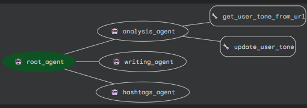

Sure! Here's the **cleaned-up `README.md`** without any setup or installation instructions — just the high-level overview and project details:

---

# LinkedIn Ghostwriter using Vertex AI ADK

This repository showcases a **multi-agent system** built with **Vertex AI’s Agent Development Kit (ADK)**. The system functions as a personalized **LinkedIn Ghostwriter**, helping users craft professional and engaging posts in their unique writing style.

---

## API Endpoints

Before we go into more details here are few API Endpoints for trying out the deployed agent you will need to write a script and send requests to these endpoints in order to test these out. The agent will be accessible/deployed on Vertex AI's agent engine for 1 week till 21-07-2025

**[Query URL](https://asia-south1-aiplatform.googleapis.com/v1/projects/writer-agent-465704/locations/asia-south1/reasoningEngines/922956448634241024:query)**

**[Stream Query URL](https://asia-south1-aiplatform.googleapis.com/v1/projects/writer-agent-465704/locations/asia-south1/reasoningEngines/922956448634241024:streamQuery?alt=sse)**

---

##  Features

*  **Profile Style Analysis**
  Analyzes a user's LinkedIn profile content (or manually submitted posts) to detect tone, structure, and preferred topics.

*  **Personalized Post Generation**
  Creates LinkedIn posts from topic ideas or bullet points, mimicking the user's tone and content patterns.

*  *Optional Enhancements*

  * Hashtag recommendations
  * Writing style rewrites (formal, casual, concise, etc.)
  * Virality score estimation *(optional)*

---

##  Tech Stack

* **Vertex AI Agent Development Kit (ADK)**
* **Python** (for tool functions and logic)
* **Large Language Models (LLMs)** with function-calling
* **Google Cloud Platform (GCP)**

---

##  Architecture Overview

---

##  Workflow

1. User submits a LinkedIn profile or writing samples
2. The **Style Analyzer Agent** identifies tone, structure, and key themes
3. User provides a topic idea or bullet points
4. The **Post Generator Agent** creates a personalized, post-ready output
5. (Optional) Suggestions for hashtags or rewrites are provided

---

##  Data Privacy

This project is built with user privacy in mind. All writing samples are processed securely, with no external sharing or persistent storage.

---

##  Acknowledgements

* [Google Cloud Vertex AI](https://cloud.google.com/vertex-ai)

---

For any other queries feel free to ping me at [Komal Pasumarthy](https://www.linkedin.com/in/komal-pasumarthy/)
